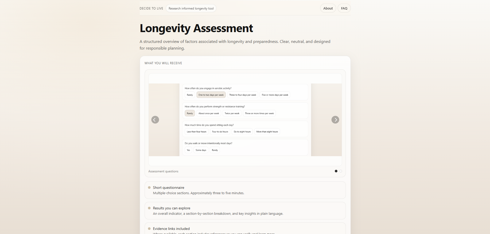
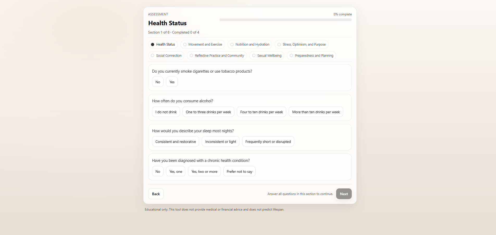
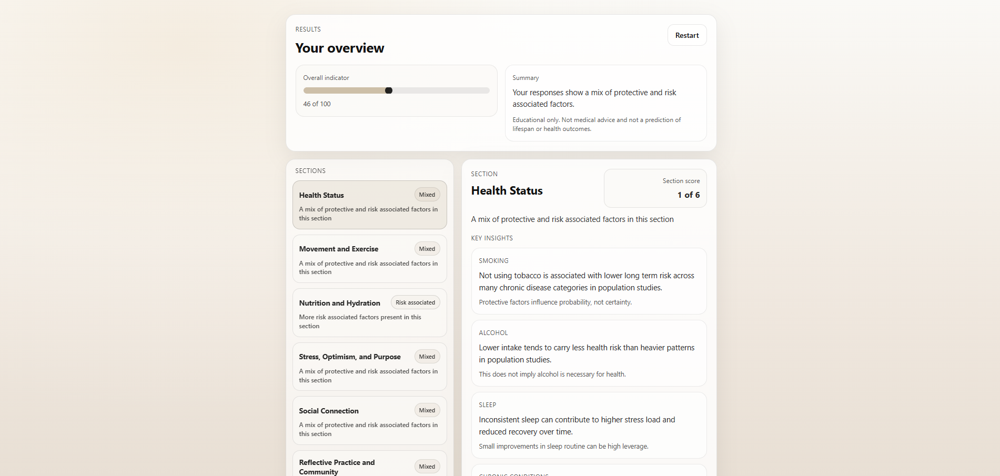
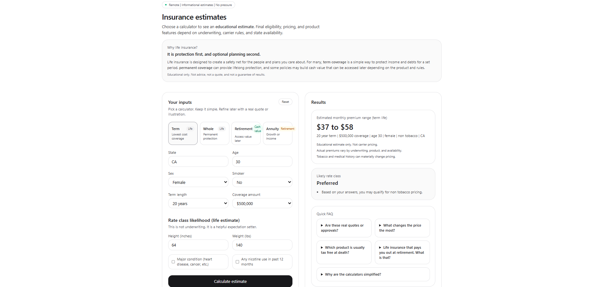

# DecideToLive.co

## About

DecideToLive is a full-stack longevity assessment platform designed to help users reflect on lifestyle habits and wellness factors through an interactive assessment experience.

Users complete a multi-section assessment and receive an educational results dashboard highlighting protective factors and areas where risk-associated factors may be present.

This project combines software development, user experience design, research-informed content organization, and personalized feedback generation.

## Links

- Live Website: https://decidetolive.co
- Life Insurance Education Tool: https://life-insuance-app.vercel.app/

---

## User Flow

1. Users complete the longevity assessment
2. Responses are processed through a custom scoring system
3. Results are generated across multiple lifestyle categories
4. Users receive a personalized summary with educational insights
5. Users can optionally explore an additional life insurance education calculator

---

## Features

### Longevity Assessment

The assessment covers multiple lifestyle categories:

- Health Status
- Movement and Exercise
- Nutrition and Hydration
- Stress, Optimism, and Purpose
- Social Connection
- Reflective Practice and Community
- Sexual Wellbeing
- Preparedness and Planning

### Results Dashboard

After completing the assessment, users receive:

- Overall indicator score
- Category-based summaries
- Protective and risk-associated factor insights
- Section-level feedback
- Educational evidence references

The results are designed for educational reflection and are not medical advice, diagnosis, or a prediction of lifespan or health outcomes.

---

## Additional Educational Tool

As an extension of the DecideToLive experience, I built a separate educational life insurance calculator to demonstrate how personalized inputs can be transformed into useful estimates and comparisons.

Life Insurance Education Tool:

https://life-insuance-app.vercel.app/

The calculator allows users to explore different planning scenarios through:

- Term life insurance education
- Whole life insurance education
- Retirement/cash value concepts
- Annuity concepts
- Coverage scenario inputs
- Educational premium estimates
- Rate class examples
- FAQ resources

This tool demonstrates how software can simplify complex topics and help users explore real-world decision-making scenarios.

Disclaimer:
This calculator provides educational estimates only and is not an insurance quote, approval, guarantee, or financial advice.

---

## Tech Stack

### Frontend

- React.js
- JavaScript (ES6+)
- JSX
- Vite
- HTML5
- CSS

### Backend

- Python
- Flask
- REST APIs

### Database

- SQLite

### Deployment

- Vercel
- Render

### Integrations

- Beehiiv newsletter integration

### Development Tools

- Git/GitHub
- Visual Studio Code
- npm

---

## Technical Highlights

- Built a full-stack application independently from concept to deployment
- Developed a custom scoring engine to analyze assessment responses
- Created reusable React components for assessment flows and results visualization
- Connected a React frontend with a Flask backend API
- Designed dynamic user feedback based on questionnaire responses
- Implemented privacy-focused design decisions by avoiding unnecessary storage of personal assessment responses
- Deployed a production web application using separate frontend and backend services

---

## Screenshots

### Landing Page

### Assessment Interface

### Results Dashboard

### Life Insurance Education Tool

---

## Deployment Note

The first visit may experience a brief loading delay due to backend cold start behavior after periods of inactivity.

Once initialized, the application functions normally.

---

## Future Improvements

Potential future improvements include:

- User accounts and saved assessment history
- Additional assessment categories
- Expanded personalization features
- PostgreSQL migration for larger scale usage
- Additional data visualization features

---

## Developer

Built by Abigail Aguilar
